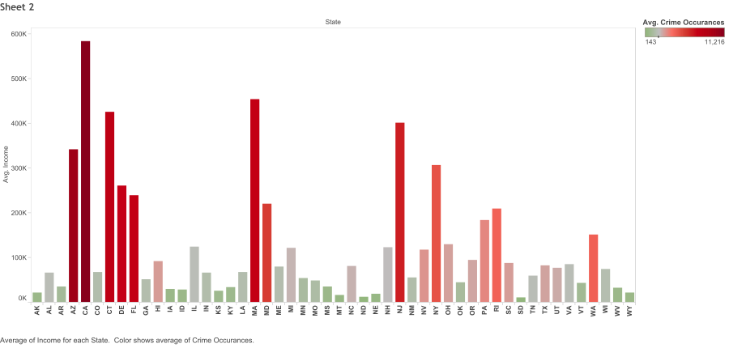
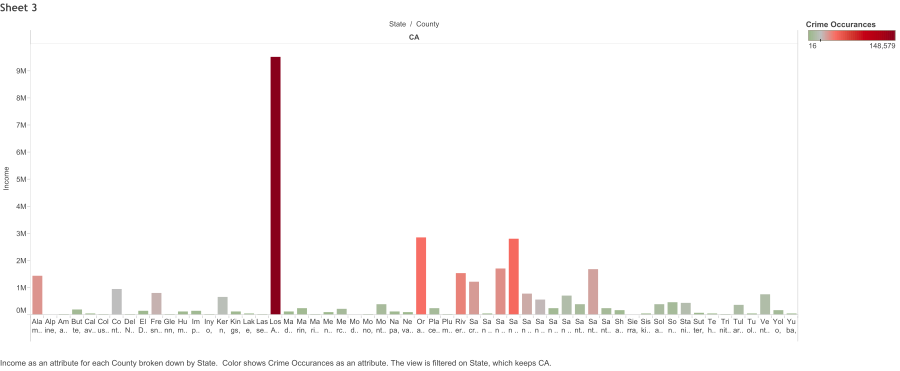
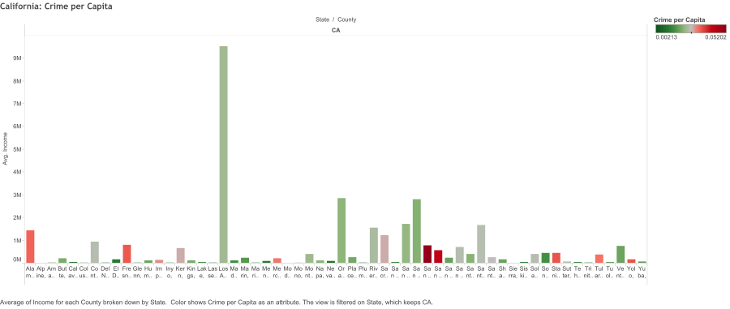
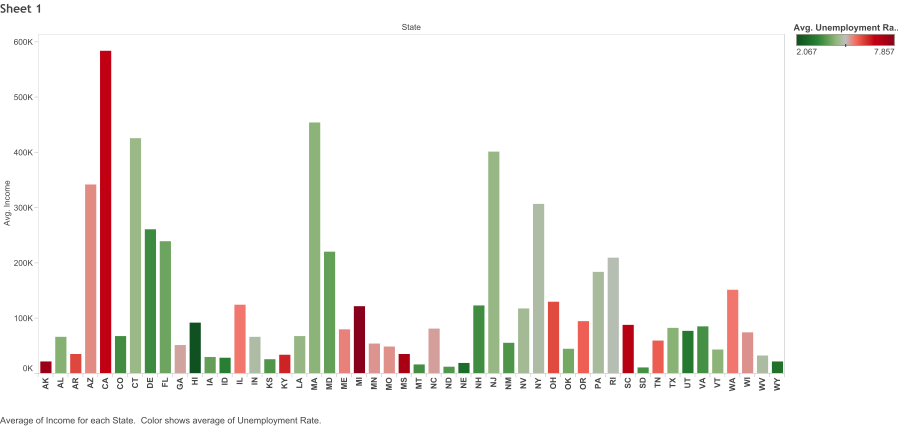

Reproducing Final Project
------------------------
**By: Mitali Sathaye and Saqib Ali**


Load Packages
------
```{r}
source("../.rProfile", echo = FALSE)
```

For our data we decided to use statistics on Income, Unemployment, and Crime. After doing research we thought it would be interesting to whether there is a correlation between the data.
```{r}
source("../01 Data/GetData.R", echo = TRUE)
```


Here we manipulated the data so that we could better represent it in our plots.
```{r}
source("../02 Data Wrangling/DataManipulation.R", echo = TRUE)
```

The first graph shows the average income for each state. As you can see there is a huge difference among the different states. We then wanted to see whether there was a strong correlation between crime and income. In order to do this we melted the data frame and compared the results. If there was a correlation the data crime data points should have been skewed more to towards the top.
```{r}
source("../03 Visualizations/Visuals.R", echo = TRUE)
```

For our first Tableau visual we wanted to find out which state had the highest incomes and what levels of crime they ahd relative to that. We saw that california had the highest income and crime so we wanted to look at it in further detail.


For our second Tableau visual we wanted to go into further detail about california and its counties income vs crime data. We found that LA had the greatest crime as well as the highest income. This does not correlate with the our research.


For our third Tableau we decided to divide the levels of crime by the population so that we could have results that would translate to crime per capita and be easier to compare. Now infact we see that our results do correlate with the research



For our final Tableau visual we wanted to see if there was a correlation between income and unemployment. We determined that on average states with lower levels of income had higher levels of unemployment



